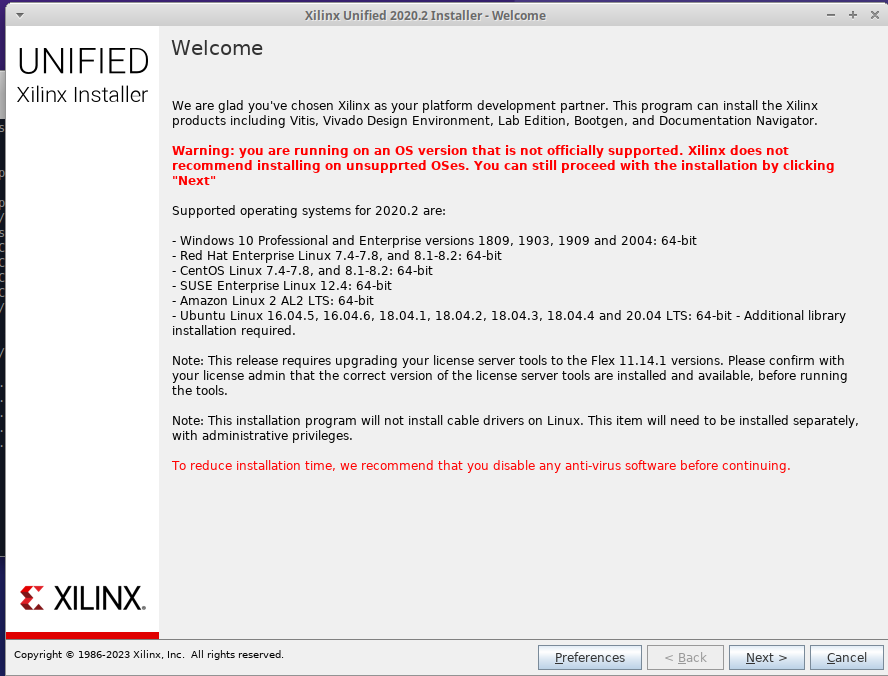

# Introduction

These [VHDL](https://en.wikipedia.org/wiki/VHDL) projects target the [Digilent Basys 3 Artix-7 Fpga Trainer Board](https://digilent.com/shop/basys-3-artix-7-fpga-trainer-board-recommended-for-introductory-users/). 

The Basys 3 is a demo board for the Xilinx [Artix-7 FPGA](https://www.xilinx.com/products/silicon-devices/fpga/artix-7.html). Significant features of the Basys 3 are 12-bit VGA output, along with switches, LEDs and seven-segment display that can be utilized in your deisgn. The Basys 3 incorporates the XC7A35T-1CPG236C FPGA device and is designed exclusively for Xilinx’s Vivado Design Suite. The Vivado ML Edition is available as a free download from AMD. 

[Vivado](https://en.wikipedia.org/wiki/Vivado) was introduced in 2012 and superceded the Xilinx ISE software which had targeted previous generations of Xilinx FPGA and PLD devices such as the Spartan series. [Xilinx](https://en.wikipedia.org/wiki/Xilinx) invented the first commercially viable field-programmable gate array (FPGA) in 1984. Xilinx was acquired by AMD in 2022. 

# Prerequisites

* Vivado Download requires Xilinx/AMD account registration with email.
* [Vivado 2020.2](https://www.xilinx.com/support/download/index.html/content/xilinx/en/downloadNav/vivado-design-tools/2022-2.html) release is used, as support of Artix-7 is removed in subsequent Vivado releases. 
* Recommend the unified Windows/Linux installer (45Gb) for Vivado ML Edition - 2022.2  Full Product Installation: _Xilinx_Unified_2020.2_1118_1232.tar.gz_
* Plan 60 Gb installation size (on Linux, can be system-wide, or local to user)
* Note Vivado 2020.2 support stops at Ubuntu 20.04
* Prerequisites on Ubuntu 20.x: `apt install build-essential libtinfo5 picocom`




Vivado ML Edition - 2022.2 Installation


# System setup and tool installation

* The Unified Installer will go directly to _Select Product_. The web install client requires login to Xilinx account. 

* Web Install client options to _Download Image Install Separately_ or _Download and Install Now_ 

* The web installer does a good job of resuming broken downloads, but could be an all-niter depending on your Internet!

* Install Xilinx cable drivers (requires root, updates udev rules _/etc/udev/rules.d/52-xilinx_ etc. )

```
    cd /Tools/Vivado/2020.2/data/xicom/cable_drivers/lin64/install_script/install_drivers/
    sudo ./install_drivers
```

# Test cable driver and serial port setup 

Additional recommended packages for new Linux system install:

`sudo apt-get install net-tools git meld geany picocom geany-plugin-vc openssh-server pinta dos2unix pico`

Be sure your user account is added to dialout group in order to have permissions for the serial port device:

`sudo usermod myuser -G dialout  -a`

My preferred terminal communication program is _picocom_:

`picocom -b 9600 /dev/ttyUSB1`


Install Vivado Board Files for Digilent FPGA Boards from [their GitHub repo](https://github.com/Digilent/vivado-boards.git)
```
    git clone https://github.com/Digilent/vivado-boards.git
    cp -r ~/vivado-boards/new/board_files/basys3/  /Tools/Vivado/2020.2/data/boards/board_files/
```

Please see the [wiki pages](https://github.com/red-bote/VHDL_Demos/wiki) for additional documentation.
