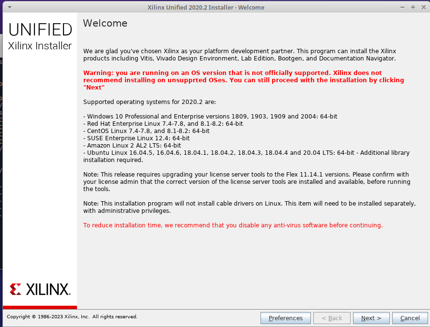

# Introduction


These [VHDL](https://en.wikipedia.org/wiki/VHDL) projects target the [Digilent Basys 3 Artix-7 Fpga Trainer Board](https://digilent.com/shop/basys-3-artix-7-fpga-trainer-board-recommended-for-introductory-users/). 

The Basys 3 is a demo board for the Xilinx [Artix-7 FPGA](https://www.amd.com/en/products/adaptive-socs-and-fpgas/fpga/artix-7.html). Significant features of the Basys 3 are 12-bit VGA output, along with switches, LEDs and seven-segment display that can be utilized in your deisgn. The Basys 3 incorporates the XC7A35T-1CPG236C FPGA device and is designed exclusively for Xilinx’s Vivado Design Suite. The Vivado ML Edition is available as a free download from AMD. 

[Vivado](https://en.wikipedia.org/wiki/Vivado) was introduced in 2012 and superceded the Xilinx ISE software which had targeted previous generations of Xilinx FPGA and PLD devices such as the Spartan series. [Xilinx](https://en.wikipedia.org/wiki/Xilinx) invented the first commercially viable field-programmable gate array (FPGA) in 1984. Xilinx was acquired by AMD in 2022. 

# Prerequisites

* [Vivado 2020.2](https://www.amd.com/en/support/downloads/adaptive-socs-and-fpgas/development-tools/2020-2.html) release is used (for forgotten reasons). 
* Download the unified Windows/Linux installer (45Gb) for Vivado ML Edition - 2020.2  Full Product Installation: _Xilinx_Unified_2020.2_1118_1232.tar.gz_ - requires AMD account registration
* Plan 60 Gb installation size (on Linux, can be system-wide, or local to user)
* *Note!* Vivado 2020.2 support stops at Ubuntu 20.04
* Prerequisites on Ubuntu 20.x: `apt install build-essential libtinfo5 picocom`



Vivado ML Edition - 2020.2 Installation

# System setup and tool installation

* The Unified Installer will go directly to _Select Product_. The web install client requires login to AMD account. 
* Web Install client options to _Download Image Install Separately_ or _Download and Install Now_ 
* Install [Xilinx cable drivers](https://docs.amd.com/r/2020.2-English/ug973-vivado-release-notes-install-license/Install-Cable-Drivers) (requires root, updates udev rules _/etc/udev/rules.d/52-xilinx_ etc. )

```
    cd /Tools/Vivado/2020.2/data/xicom/cable_drivers/lin64/install_script/install_drivers/
    sudo ./install_drivers
```

# Test cable driver and serial port setup 

Additional recommended packages for new Linux system install:

`sudo apt-get install net-tools git meld geany picocom geany-plugin-vc openssh-server pinta dos2unix pico`

Be sure your user account is added to dialout group in order to have permissions for the serial port device:

`sudo usermod myuser -aG dialout`

My preferred terminal communication program is _picocom_:

`picocom -b 9600 /dev/ttyUSB1`

Install Vivado Board Files for Digilent FPGA Boards from the [Digilent GitHub repo](https://github.com/Digilent/vivado-boards.git)
```
    git clone https://github.com/Digilent/vivado-boards.git
    cp -r ~/vivado-boards/new/board_files/basys3/  /Tools/Vivado/2020.2/data/boards/board_files/
```


Please see my [wiki pages](https://github.com/red-bote/VHDL_Demos/wiki) for additional documentation.
